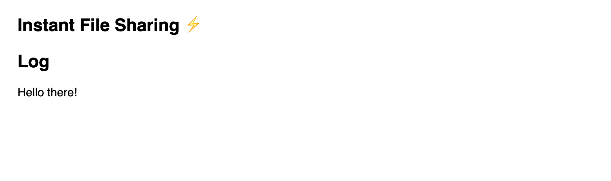

# 01 - Add a log section to the page

Add a section to the page that we can use to show log messages whenever an event occurs. For example, we can show information about the status of the WebTorrent client or any errors that might occur.

Write some log "helper functions" that will helpfully add different types of messages to the log section of the page.

## Tips

```html
<section>
  <h2>Log</h2>
  <div id='log'></div>
</section>
```

Next, let's add some JavaScript helper functions that let us add different types of messages to the log section

```js
// Log a string message
function log (message) {
  const log = document.querySelector('#log')
  const p = document.createElement('p')
  p.textContent = message
  log.appendChild(p)
}

// Log an error object
function logError (err) {
  const log = document.querySelector('#log')
  const p = document.createElement('p')
  p.textContent = err.message
  p.style.color = 'red'
  log.appendChild(p)
}

// Log an HTML element
function logElement (elem) {
  const log = document.querySelector('#log')
  log.appendChild(elem)
}
```

Next, let's log a test message to say hello to the user!

```js
function init () {
  log('Hello there!')
}

init()
```

Notice how we created a function called `init()` and immediately called it. We're going to put all the code that immediately runs when the user loads our page into this `init()` function so it's nicely organized all together in one place.

## Verify

Your page should look something like this:



If you are stuck, [read the solution](https://codepen.io/ferossity/pen/yLYdxom).

When you are ready, [go to the next exercise](02.md).
