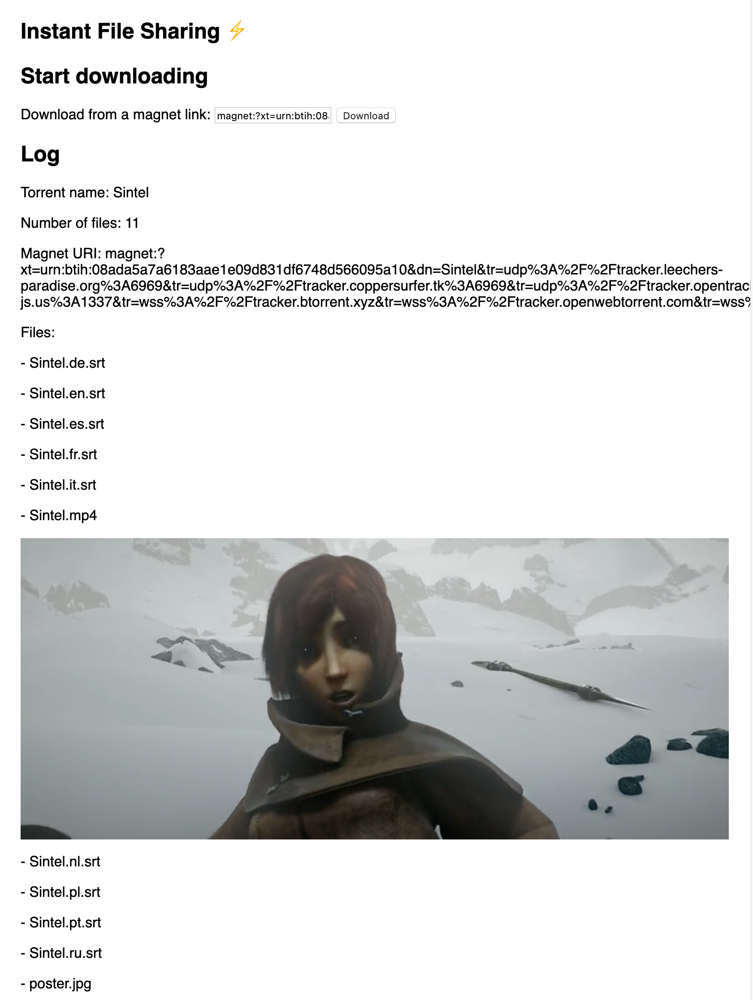

# 03 - Display the file contents in the page

Once the torrent has been added, render all the files into the page using the `appendTo()` method so the user can enjoy the files.

## Tips

Let's change our `client.add` function call so that we can respond once the torrent has been successfully added. Change the line to call a `handleTorrent` function:

```js
client.add(magnetUrl, handleTorrent)
```

We can remove the lines where we log `Hello there!` and `Adding torrent!` now, to save space.

Now, let's implement the `handleTorrent` function. We want it to listen for errors or warnings specific to this torrent and to also log information about the torrent we just added.

```js
function handleTorrent (torrent) {
  torrent.on('warning', logError)
  torrent.on('error', logError)

  log(`Torrent name: ${torrent.name}`)
  log(`Number of files: ${torrent.files.length}`)
  log(`Magnet URI: ${torrent.magnetURI}`)
}
```

Now, let's add information about each file in the torrent to the page, and finally render the file content itself. This means that for video files, the videos will show up directly in the page. Same goes for audio files, PDF files, and so on.

Add this to your `handleTorrent()` function:

```js
log('Files:')

torrent.files.forEach(file => {
  // Log file name and size
  log(`- ${file.name}`)

  // Render the file in the page
  file.appendTo('#log', { autoplay: true, muted: true }, err => {
    if (err) logError(err)
  })
})
```

The argument to `appendTo` is a CSS selector that describes an element on the page. The argument `'#log'` represents the `<div id='log'>` tag that we added to the page earlier.

Notice how we set the option `{ autoplay: true }` to make the video play automatically. We also set the option `{ muted: true }` so that the video will start out muted. (Modern browsers block audio that plays without user interaction, so this combination of options allows the video to start playing automatically without being blocked.)

To learn more about the `appendTo` API, [read the docs](https://webtorrent.io/docs).

## Verify

Try adding a magnet link and confirm that the information about the torrent as well as the file content appears in the log without any error messages! You can find a number of different torrent files and magnet links to test with on [this page](https://webtorrent.io/free-torrents).

Here's the magnet link for Sintel for your convenience:

```
magnet:?xt=urn:btih:08ada5a7a6183aae1e09d831df6748d566095a10&dn=Sintel&ws=https%3A%2F%2Fwebtorrent.io%2Ftorrents%2F&xs=https%3A%2F%2Fwebtorrent.io%2Ftorrents%2Fsintel.torrent
```

Try adding this magnet link and confirm that your page looks something like this:



If you are stuck, [read the solution](https://codepen.io/ferossity/pen/oNjrPRp).

When you are ready, [go to the next exercise](04.md).
