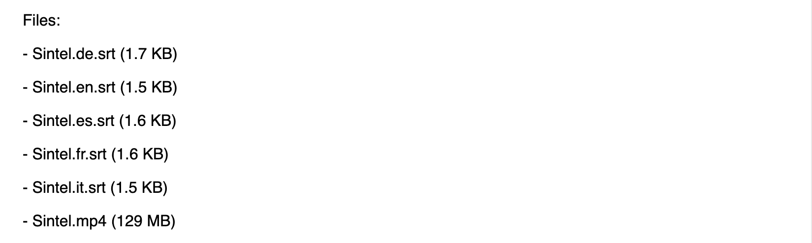

# 04 - Display the size of each file

Let's add information about the size of each file to the page output.

## Tips

Let's update the code so that when you log out the file name, we also add the file size in parenthesis. For example, we want the output for Sintel's list of files to look like this:

```
Files:
- Sintel.de.srt (1.7 KB)
- Sintel.en.srt (1.5 KB)
- Sintel.es.srt (1.6 KB)
- Sintel.fr.srt (1.6 KB)
- Sintel.it.srt (1.5 KB)
- Sintel.mp4 (129 MB)
```

Notice how the file sizes are printed in human-friendly format with `KB` for kilobytes and `MB` for megabytes. This functionality is provided for you by a library called [`prettier-bytes`](https://github.com/Flet/prettier-bytes). You can import `prettier-bytes` by adding this script tag to your HTML:

```html
<script src='https://bundle.run/prettier-bytes'></script>
```

This provides a `prettierBytes` function on the global `window` object.

Now you can call prettierBytes with a number of bytes and it will return a friendly human-readable string. For example:

```
prettierBytes(235) // returns '235 B'
prettierBytes(2335) // returns '2.3 KB'
prettierBytes(23552) // returns '24 KB'
prettierBytes(235520) // returns '236 KB'
prettierBytes(2355520) // returns '2.4 MB'
```

Update the `log(`- ${file.name}`)` line in your `handleTorrent()` function to include the number of bytes in the torrent file. Rather than give you the code for this, we're going to let you look up how to find the size of a torrent file in the [WebTorrent docs](https://webtorrent.io/docs).

## Verify

Try adding a magnet link and confirm that the file size information appears in the list of files. You can find a number of different torrent files and magnet links to test with on [this page](https://webtorrent.io/free-torrents).

Here's the magnet link for Sintel for your convenience:

```
magnet:?xt=urn:btih:08ada5a7a6183aae1e09d831df6748d566095a10&dn=Sintel&ws=https%3A%2F%2Fwebtorrent.io%2Ftorrents%2F&xs=https%3A%2F%2Fwebtorrent.io%2Ftorrents%2Fsintel.torrent
```

Try adding this magnet link and confirm that your file list looks like this:



If you are stuck, [read the solution](https://codepen.io/ferossity/pen/JjYgGMR).

When you are ready, [go to the next exercise](05.md).
