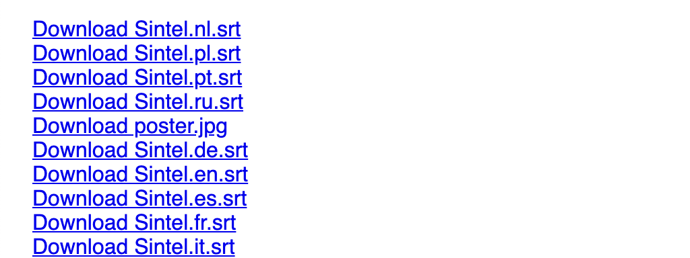

# 05 - Display a download link for each file

Let's add a download link for each file so the user can easily save files to their `Downloads` folder if they want to.

## Tips

Use the `file.getBlobURL()` function to get a URL which can be used to link to the file in the torrent. You can use this as the `href` in a link that you add to the page.

For each file in the torrent, run the following code:

```js
// Add a download link
file.getBlobURL((err, url) => {
  if (err) {
    // If there was an error, add it to the log section
    logError(err)
    return
  }

  // Create a link element
  const a = document.createElement('a')
  a.href = url
  a.textContent = 'Download ' + file.name
  a.style.display = 'block'

  // Download the file with given name when clicked
  a.download = file.name

  // Add the link to the log section
  logElement(a)
})
```

To learn more about the `getBlobURL` API, [read the docs](https://webtorrent.io/docs).

Try changing the link's attributes. Answer these questions:

- What happens if you remove the `download` parameter and click on the link?
- What happens if you change the value assigned to `a.download`? For example, if you set `a.download = 'hello'` and click the link, what happens?

## Verify

Try adding a magnet link and confirm that the file size information appears in the list of files. You can find a number of different torrent files and magnet links to test with on [this page](https://webtorrent.io/free-torrents).

Here's the magnet link for Sintel for your convenience:

```
magnet:?xt=urn:btih:08ada5a7a6183aae1e09d831df6748d566095a10&dn=Sintel&ws=https%3A%2F%2Fwebtorrent.io%2Ftorrents%2F&xs=https%3A%2F%2Fwebtorrent.io%2Ftorrents%2Fsintel.torrent
```

Try adding this magnet link and confirm that you see download links that look like this:



**Note: If your download links don't work, read this.** Some browsers (like [Chrome 83+](https://www.chromestatus.com/feature/5706745674465280)) block downloads from iframes, which is what CodePen uses to display the preview of the site we've been building. If your download links don't work, then click "Change View" at the top and select "Debug mode". Now the site takes up the whole window and downloads should not be blocked.

If you are stuck, [read the solution](https://codepen.io/ferossity/pen/bGVXEjO).

When you are ready, [go to the next exercise](06.md).
