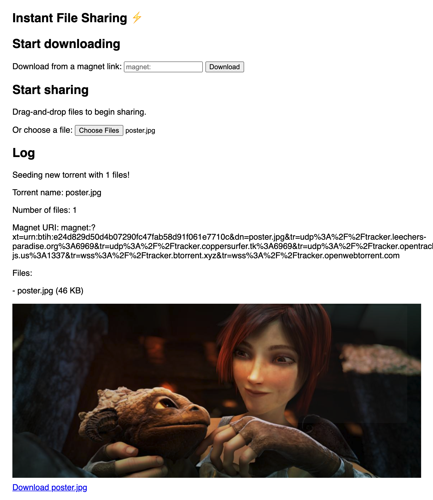

# 07 - Add drag-and-drop for sharing files

Let's make it easier for the user to share files. Some users prefer to drag-and-drop files directly onto the webpage rather than selecting them from the file picker UI.

## Tips

To do this we'll use the [`drag-drop`](https://github.com/feross/drag-drop) library that saves us from writing a bunch of boilerplate code to listen to the proper event. You can import `drag-drop` by adding this script tag to your HTML:

```html
<script src='https://bundle.run/drag-drop'></script>
```

This provides a `dragDrop` function on the global `window` object.

Add this to your `init()` function:

```js
// Share files via drag-and-drop anywhere on the page
const body = document.querySelector('body')
dragDrop(body, seedFiles)
```

Now whenever the user drops files onto the page by drag-and-drop, the `seedFiles` function will be called with an array of `File` objects representing each file. We already implemented `seedFiles` in the last step, so that's all we really need to do to support drag-and-drop.

Except there's one tiny edge case we should address. It's possible for the `files` array to be empty (zero length) if the user drags-and-drops something that is not a file, like some higlighted text. If that happens, we don't want to create a torrent with no files in it. That's not very useful.

Let's silently ignore any drag-and-drops that have a `files` array with a length of zero. Add this to your `seedFiles` function at the very top of the function:

```js
// Ignore any drag-and-drop that is not a file (i.e. text)
if (files.length === 0) return
```

Nice work!

## Verify

Try dragging some files from your local filesystem and dropping them anywhere on the webpage.

You should see the message "Seeding new torrent with XX files!" where `XX` is the number of files that you selected. Finally, you should also see the file contents show up on the page, along with useful information like the new torrent's magnet link.

Your page should look like this:



After sharing some files, open a duplicate CodePen tab and paste the magnet link in the download input and start downloading it. You should see the file get transferred from one browser tab to another!

If you are stuck, [read the solution](https://codepen.io/ferossity/pen/vYNoGbw).

When you are ready, [go to the next exercise](08.md).
