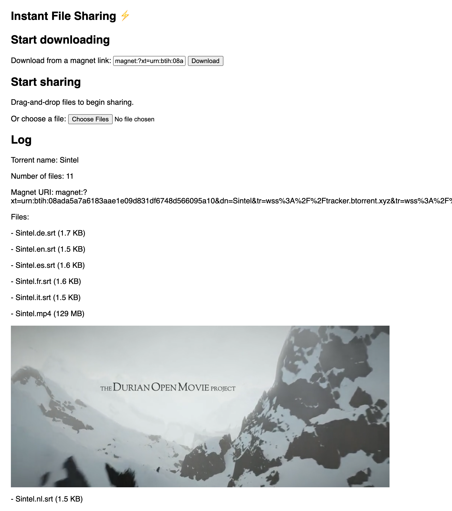

# 08 - Add WebTorrent tracker servers to all added torrents

Magnet links can contain "tracker server" URLs. These are servers which can help your WebTorrent client to identify peers which may be sharing the torrent files you are interested in.

Since WebTorrent is a new P2P network, it's helpful to add the WebTorrent tracker servers to all magnet links added by users, even if the magnet link doesn't contain these servers.

## Tips

To do this we'll use the [`create-torrent`](https://github.com/feross/create-torrent) library to get a list of recommended tracker servers. This package is built-in to WebTorrent but not exposed directly, so that's why we must import it separately. You can import `create-torrent` by adding this script tag to your HTML:

```html
<script src='https://bundle.run/create-torrent'></script>
```

This provides a `createTorrent` function on the global `window` object.

This package exposes a list of tracker servers as the `createTorrent.announceList` property. This list is an array of arrays, to satisfy the BitTorrent spec. Let's process it into a simple array of tracker servers. Add this to the top of your `addTorrent()` function:

```js
const announce = createTorrent.announceList
  .map(arr => arr[0])
```

But we only want to get the tracker servers which are useable in the browser, specifically server URLs that start with `wss://` or `ws://` which is how WebSocket URLs are represented.

So, let's update that line of code to:

```js
const announce = createTorrent.announceList
  .map(arr => arr[0])
  .filter(url => url.startsWith('wss://') || url.startsWith('ws://'))
```

Next, let's use this array of servers when adding a new torrent. Update the `client.add(magnetUrl, handleTorrent)` line to pass in the list of trackers as an option called `announce`:

```js
client.add(magnetUrl, { announce }, handleTorrent)
```

Now the trackers listed in `announce` array will be added the list present in the magnet url.

## Verify

To verify that the WebTorrent trackers are being added, even when they're not specified in the magnet link itself, try adding the following miniamlist magnet link:

```
magnet:?xt=urn:btih:08ada5a7a6183aae1e09d831df6748d566095a10&dn=Sintel
```

If the download starts, then that means you were able to find peers from WebTorrent tracker servers even though none were specified in the magnet link itself. This will make the file sharing site a bit more reliable and easy to use.

This is what your page should look like:



If you are stuck, [read the solution](https://codepen.io/ferossity/pen/pojMbzw).

When you are ready, [go to the next exercise](09.md).

