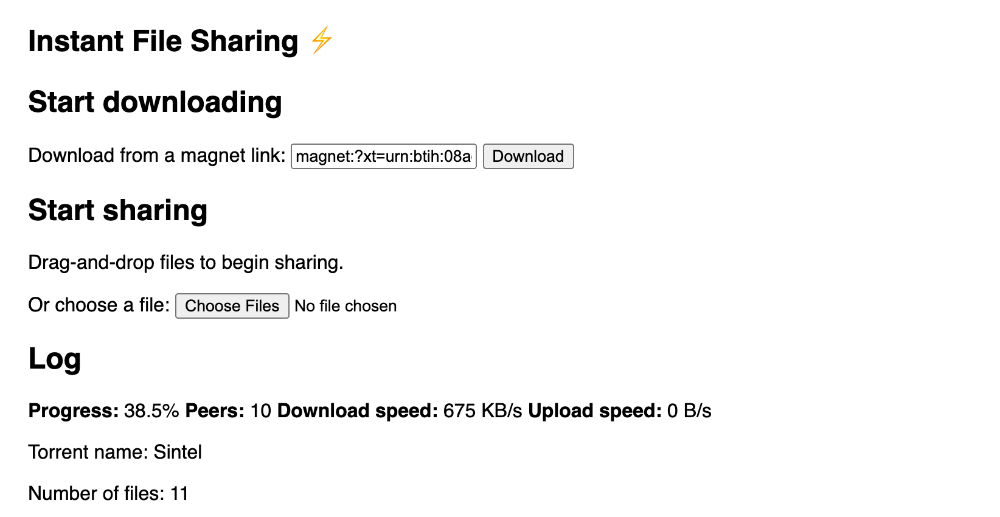

# 09 - Show useful metadata to the user

Let's show useful metadata to the user, like download progress, number of peers, and download/upload speed.

## Tips

To get started, let's add a `<div>` to the "Log" section of the page which we'll use to store the current stats. Unlike the rest of the log, we don't want to continually add new entries to this section. Rather, we want to replace it entirely each time we update the speed. This way, only the latest speed is shown.

Update the HTML for section of the page that holds the "Log" to look like this:

```html
<section>
  <h2>Log</h2>
  <div id='speed'></div>
  <div id='log'></div>
</section>
```

We're going to put the speed stats into the `<div id='speed'>` element. The rest of the logs will continue to be appended to the `<div id='log'>` element.

Next, we need to regularly call a function `updateSpeed`, once per second, to update the contents of the `<div id='speed'>` element. Let's do that by adding this to the `handleTorrent()` function:

```js
// Show the speed stats immediately
updateSpeed(torrent)

// Update the speed stats once per second
const interval = setInterval(() => {
  updateSpeed(torrent)
}, 1000)

// When the torrent is done, update the stats one last time, then stop calling updateSpeed()
torrent.on('done', () => {
  updateSpeed(torrent)
  clearInterval(interval)
})
```

Next, you need to implement the `updateSpeed()` function. We'll give the basic outline of this function but leave it to you to fill in the details. You'll need to look through the [WebTorrent docs](https://webtorrent.io/docs) to find the relevant properties that contain the stats you need.

Here's the skeleton of the `updateSpeed()` function:

```js
function updateSpeed (torrent) {
  const speed = `
    <b>Progress:</b> ${TODO}%
    <b>Peers:</b> ${TODO}
    <b>Download speed:</b> ${TODO}/s
    <b>Upload speed:</b> ${TODO}/s
  `

  document.querySelector('#speed').innerHTML = speed
}
```

You'll want to replace all the `TODO` references with the actual variables for each of the stats. Don't forget about your `prettierBytes` helper function for formatting the byte counts nicely!

## Verify

Try adding a magnet link and confirm that the speed and other stats show up correctly at the top of the log without any issues! You can find a number of different torrent files and magnet links to test with on [this page](https://webtorrent.io/free-torrents).

Here's the magnet link for Sintel for your convenience:

```
magnet:?xt=urn:btih:08ada5a7a6183aae1e09d831df6748d566095a10&dn=Sintel&ws=https%3A%2F%2Fwebtorrent.io%2Ftorrents%2F&xs=https%3A%2F%2Fwebtorrent.io%2Ftorrents%2Fsintel.torrent
```

Here's what it should look like:



If you are stuck, [read the solution](https://codepen.io/ferossity/pen/gOaVwwX).

When you are ready, [go to the next exercise](10.md).

